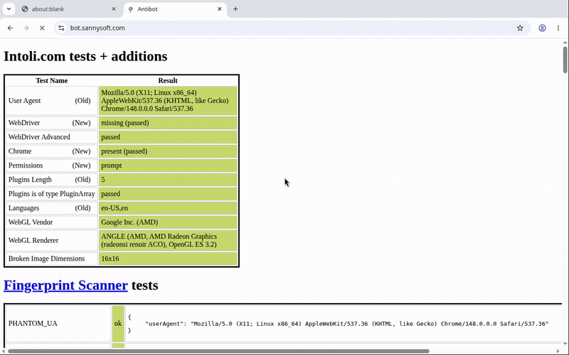

# Veil

**A stealth automation runtime for AI agents. Drives real Chrome over raw CDP — no Playwright, no Puppeteer, no WebDriver, zero runtime dependencies.**



*Veil driving real Chrome: bot.sannysoft.com all-green, then straight through Cloudflare's JS challenge — no patches, no plugins.*

To Instagram, Google, Reddit, Datadome, Akamai — Veil *is* Chrome. Same binary, same
TLS, same JS engine, same canvas/WebGL/font fingerprint a human's browser has. We
don't reimplement the browser (that's Chromium's 20-year, 1000-engineer job, and a
hand-rolled engine is *easier* to fingerprint, not harder). We replace the part that
gets you caught: **the automation layer.**

---

## Why not Playwright / Puppeteer?

They're powerful and great for scripted QA. For *agents on hostile sites* they have three structural problems:

| Problem | Playwright/Puppeteer | Veil |
|---|---|---|
| **Detectable** | `navigator.webdriver=true`, `--enable-automation`, the `Runtime.enable` CDP tell, `HeadlessChrome` UA | webdriver scrubbed, no automation switches, no `Runtime.enable`, UA + client-hints normalized |
| **Robotic input** | instant teleport clicks, fixed-cadence typing → behavioural detection | curved Bézier mouse paths, eased timing, human keystroke cadence |
| **Brittle for agents** | CSS/XPath selectors that break constantly | accessibility-tree snapshot → stable integer `ref`s; agents never write a selector |

Veil is **dependency-free** — Node 24 / Bun ship a global `WebSocket`, so the entire
CDP transport is ~120 lines we own. Nothing to patch, nothing to leak.

## How Veil compares (honest)

The "real Chrome over raw CDP" idea isn't new — Python's [`nodriver`](https://github.com/ultrafunkamsterdam/nodriver)
pioneered it, and [Camoufox](https://camoufox.com) (a C++-patched Firefox) scores even
better on pure stealth. Veil isn't claiming to out-stealth them. Its wedge is **where it
lives and how agents use it**:

- **TypeScript-native.** The JS/TS agent ecosystem (Vercel AI SDK, LangChain.js, MCP) has
  no strong raw-CDP stealth driver — it's stuck on Playwright + stealth plugins, or
  shelling out to Python `nodriver`. Veil is that missing piece.
- **MCP-native.** Ships an MCP server, so any agent gets stealth browsing as tools with
  zero glue.
- **Agent-first, not scraper-first.** Accessibility-tree refs and human input are built for
  an LLM driving the browser, not for a scraping script.

If you're in Python and just want raw stealth, use `nodriver` or Camoufox — they're great.
Veil is for **TypeScript agents and MCP hosts.**

## Quick start

**Prerequisites:** Chrome/Chromium on PATH (or `VEIL_CHROME=/path/to/chrome`), and Bun.

```bash
bun install
bun run examples/selftest.ts   # launches real Chrome, runs the full chain
```

**In your code:**

```ts
import { Browser } from "veilbrowser";

const browser = await Browser.launch({ headless: false });   // headful = stealthiest
const page = await browser.newPage();
await page.goto("https://example.com");

// Accessibility-tree snapshot → stable integer refs (no selectors).
const snap = await page.snapshot();
console.log(snap.text);
//  [1] textbox "Search"
//  [2] button "Sign in"

await page.fill(1, "hello");          // act by ref — human typing, jittered timing
await page.click(2);                  // curved Bézier mouse path, real CDP input
const png = await page.screenshot();  // PNG buffer for a vision model

await browser.close();
```

## How the stealth works

1. **Launch (`launcher.ts`)** — a real Chrome with the flags a *normal* profile uses,
   minus the automation switches Playwright adds. `--disable-blink-features=AutomationControlled`
   flips `navigator.webdriver` to `false` at the engine level. Persistent `userDataDir`
   so the profile looks *used* (history, cookies), not freshly minted.
2. **Transport (`cdp.ts`)** — raw WebSocket, flat session mode. **We never call
   `Runtime.enable`** — that command is a primary CDP detection vector. `Runtime.evaluate`
   works without it.
3. **Page patch (`stealth.ts`)** — injected via `addScriptToEvaluateOnNewDocument`
   *before* any site code, on every frame: normalizes `webdriver`, `window.chrome`,
   `plugins`, `languages`, `permissions.query`, WebGL vendor — and makes the patched
   functions' `toString()` look native so the patch itself can't be detected. Kept
   deliberately small; over-patching is its own fingerprint.
4. **UA / client hints (`page.ts`)** — strips the `HeadlessChrome` token from the UA
   *and* the `Sec-CH-UA` brand headers.
5. **Human input (`human.ts`)** — seedable PRNG drives curved mouse paths and
   jittered keystroke timing.

## Agent tooling (the other half of the product)

The selling point isn't only stealth — it's that agents drive it *well*:

- **`snapshot()`** returns the page as a flat numbered index from the accessibility
  tree (the semantic layer screen readers use). The #1 cause of agent breakage —
  guessed CSS/XPath selectors — is gone. The agent acts on a stable `ref`.
- **`screenshot()`** returns a PNG buffer, ready for vision grounding.
- **`click` / `fill` / `type`** drive real CDP input with human dynamics.
- **`waitFor(expr)`** replaces flaky fixed sleeps.

## Federated sign-in (FedCM)

"Sign in with Google" one-tap and the newer `navigator.credentials.get({identity})`
flows render their account chooser as **native browser UI** — the button is a
cross-origin IdP iframe and the chooser is browser chrome, so no synthetic click can
reach either. That's a wall for agents logging into Google-SSO apps. Veil drives it
over CDP's FedCM domain instead:

```ts
// Passive / one-tap (fires on load once you're signed in to the IdP):
await page.enableFedCm();          // autoSelectFirst — picks account 0 for you
await page.goto("https://app.example.com/");
await page.waitForFedCmDialog();   // chooser intercepted + auto-selected
await page.disableFedCm();

// Active "Sign in with Google" button, one call:
const account = await page.signInWithFedCm({ triggerRef: btn.ref });
```

`enableFedCm` also `resetCooldown`s (Chrome silently suppresses the dialog after
repeated dismissals) and binds account selection to the page's own CDP session — pick
the wrong target and the dialog, plus the page's `credentials.get()`, hangs forever.
Enable it **on demand**, right before the sign-in: turning it on globally hangs any
site that silently probes FedCM at load. End-to-end run against the canonical demo IdP:
`bun run examples/fedcm.ts`.

## No localhost / LAN leak (private-network block)

Fingerprinters (iphey, pixelscan, …) don't read your process list — they can't.
They **port-scan `127.0.0.1` from page JavaScript**, timing which local ports answer,
and map open ports to software: VNC on `:5900`, an antidetect API on `:3001`, a dev
server on `:3000`. That both fingerprints you *and* leaks your LAN to every site you
visit. Most stealth stacks (nodriver, Camoufox, Playwright-stealth) don't stop it.

Veil does, **on by default**. Every request from a page to a loopback or private
(`127.0.0.0/8`, `10/8`, `172.16/12`, `192.168/16`, `::1`, `.localhost`) address is
failed **uniformly and instantly** — the same error whether the port is open or closed —
so a scan can't tell them apart and comes back empty.

```ts
const browser = await Browser.launch();                 // block is on
const browser = await Browser.launch({ blockPrivateNetwork: false }); // opt out
// per-page, toggle at runtime:
await page.blockPrivateNetwork();
await page.unblockPrivateNetwork();
```

Still allowed: the agent's own top-level navigation to a private host
(`page.goto("http://localhost:3000")`), and a localhost page loading its own localhost
resources — only a **public page reaching a private host** is blocked. Known gap: exotic
IP encodings (decimal/hex); real-world scanners use the canonical forms above.

## Detection scorecard (measured, Chrome 148)

Run it yourself: `bun run examples/detect.ts` (headless) or `VEIL_HEADFUL=1 bun run
examples/detect.ts` (headful — Veil auto-starts its own Xvfb, no wrapper needed).

Measured on an AMD Radeon (Renoir APU) host, real hardware GL via ANGLE/EGL:

| Detector | Mode | sannysoft | CreepJS "headless" | CreepJS "stealth" |
|---|---|---|---|---|
| **Veil — headful + auto-Xvfb + real GPU** | recommended | **57/57** | **0%** | **0%** |
| Veil — headless + real GPU | server/fast | **57/57** | 33% | 0% |
| _(earlier: SwiftShader + heavy stealth)_ | _superseded_ | 57/57 | 67% | 20% |

**Live targets** — the full [scrapingcourse.com](https://www.scrapingcourse.com/) challenge
suite, reproducible with `bun run examples/scrapingcourse.ts` (residential IP, headful):

| Target | Result |
|---|---|
| Antibot Challenge | **Bypassed** — "You bypassed the Antibot challenge" (~3s auto-solve) |
| Cloudflare JS Challenge | **Bypassed** — "You bypassed the Cloudflare challenge" |
| Cloudflare Antibot + login | **Bypassed** — cleared the wall, rendered the real login form |
| Cloudflare **Turnstile** + login | **Passed** — managed Turnstile issues its token to real Chrome (a 700+ char `cf-turnstile-response`); the form submits. We don't *solve* a captcha — the real browser *earns* the token |
| Demo suite — JS rendering, infinite scroll, pagination, table parsing, load-more, CSRF/login | all served clean |
| Reddit — incl. its JS challenge | served clean (challenge auto-solved) |
| Instagram — public profile | served clean |

**12/12 cleared** on a clean residential IP. Two honest caveats, not hidden:
Cloudflare's JS *interstitial* difficulty scales with **IP reputation** — hammer one IP
and it escalates (that's IP rep, not a browser tell; use proxies at volume). And what we
do **not** yet claim: an **interactive checkbox** reCAPTCHA/Turnstile that demands a human
click, enterprise DataDome/Kasada, and high-volume behavioural trust on logged-in sessions.
We test before we claim.

**What moved the needle (each verified by re-running the suite):**
1. **Real GPU, not SwiftShader.** `--use-gl=angle --use-angle=gl-egl` drives the actual
   AMD GPU → an authentic, self-consistent WebGL fingerprint. No vendor spoof = no *lie*
   for CreepJS's pixel-hash to catch.
2. **Headful on a server.** Veil manages its own Xvfb display, so "headful" needs no
   desktop. Eliminates the headless render quirks + tiny-screen tell (33% → 0%).
3. **Slim, self-gating stealth.** The biggest surprise: the *stealth patches themselves*
   were the "20% stealth" signal. A correctly-launched Chrome already reports
   `webdriver === false` (the right human value — forcing `undefined` is *worse*), 5
   plugins, a real `chrome` object. So each patch now fires only when the value is
   genuinely anomalous; on healthy Chrome it's a no-op. Smaller surface = nothing to detect.

## Use from an AI agent (MCP)

Veil ships an MCP server (`src/mcp.ts`) — already wired into **persoje**
(`~/.config/persoje/mcp.json`), exposing 10 tools: `goto`, `snapshot`, `click`, `fill`,
`type`, `screenshot`, `eval`, `fedcm_enable`, `fedcm_signin`, `close`. Verified end-to-end
through persoje's own MCP client (discover → goto → snapshot). Any MCP host works:

```jsonc
{ "servers": { "veil": {
  "command": "/home/armani/.bun/bin/bun",
  "args": ["run", "/home/armani/projects/veil/src/mcp.ts"],
  "env": {}                          // headful + auto-Xvfb + real GPU (0% CreepJS).
                                     // Set VEIL_HEADLESS=1 for the faster server mode.
} } }
```

## Testing

```bash
bun run examples/selftest.ts   # end-to-end: launch, stealth, snapshot, interact
bun run examples/detect.ts     # bot-detection scorecard (bot.sannysoft.com, etc.)
deno test tests/*.test.ts      # unit tests: PRNG, mouse paths, ref numbering
```

Unit tests cover:
- **PRNG (`human.test.ts`)**: xorshift32 determinism, range/int bounds, keystroke cadence, mouse timing
- **Snapshot refs (`snapshot.test.ts`)**: ref numbering (1-based, sequential, no gaps), AX-tree filtering
- **CDP framing (`cdp-messages.test.ts`)**: JSON-RPC structure, sessionId routing, command/response correlation

## Status

**Working today** (verified against Chrome 148):
- Zero-dep CDP runtime (raw WebSocket, flat session mode)
- Stealth launch + page-script injection (`--disable-blink-features=AutomationControlled`)
- UA/client-hint scrub (no "HeadlessChrome" token)
- WebGL backend selection (hardware GPU via ANGLE/EGL, or SwiftShader + vendor masking)
- AX-tree snapshot → stable integer refs for agent-friendly interaction
- Human-like input: curved Bézier mouse paths, jittered keystroke timing, real CDP input
- PNG screenshots (vision-model ready)
- MCP server (`src/mcp.ts`) — stdio JSON-RPC; persoje, Claude, any MCP host drives Veil natively

**Roadmap toward production:**
- [ ] Adversarial fingerprint suite — continuous scoring (CreepJS, sannysoft, Datadome demo)
- [ ] `Runtime.enable`-leak hardening via isolated worlds for all eval
- [ ] Headful-on-server via managed Xvfb; profile + proxy pools
- [ ] Vision-based element grounding fallback (sparse AX-trees, canvas apps)
- [ ] Network interception; response capture; session persistence & profile warm-up
- [ ] Per-tab concurrency (many tabs, one socket — transport already supports it)

## License

MIT.
